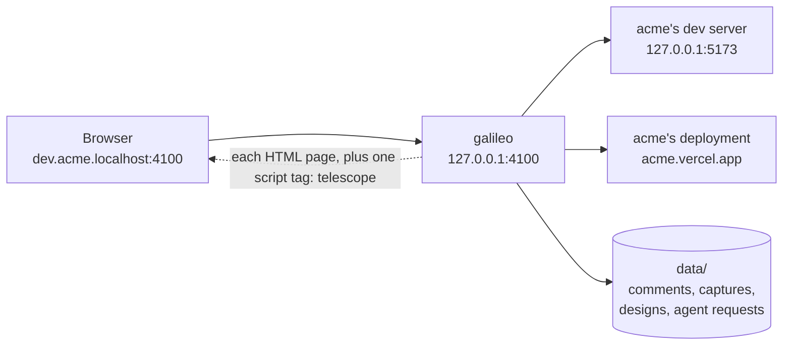

# galileo

**Inspect every app on this machine, at its own address, with telescope in every page.**

galileo is XO's local inspector. Give an app a name and the port it runs on
(or a URL), and galileo answers for it at `<name>.localhost:4100`, each
version at its own address:

```
acme.localhost:4100        acme, its default version
dev.acme.localhost:4100    acme's dev server, e.g. :5173
live.acme.localhost:4100   acme's deployment, e.g. https://acme.vercel.app
```

Every HTML page galileo serves carries **telescope**, XO's in-page bar: switch
between apps, versions and pages, and inspect, comment on, capture, record, or
ask an agent about the page in front of you. galileo is where you look from;
telescope is what you look through. Apps change nothing to get it: galileo
appends one script tag as each page streams through.



galileo starts nothing: it routes to whatever already answers on an app's
port. It listens on `127.0.0.1` only, and keeps what telescope makes in its
own `data/` folder.

## Quick start

Node 20 or later, and nothing to install:

```bash
npm start -- --target web=5173      # http://web.localhost:4100/ is whatever runs on :5173
```

- <http://localhost:4100/> lists every address galileo answers, live, and how
  it works.
- <http://localhost:4100/launcher> adds and removes apps and versions, picks
  each app's default version, and edits telescope's design.
- `npm run demo` puts a sample site behind galileo as two versions: see
  [the demo](#the-demo).

## Adding an app

An app is a name, one or more versions, and an upstream for each version: a
port (`5173`), a `host:port`, or an `http(s)` URL.

| Where | How |
| --- | --- |
| the launcher | a name, an optional version, and a port or URL |
| when starting | `npm start -- --target web=5173 --target live.web=https://web.vercel.app` |
| from a program | `POST localhost:4100/__xo/api/targets` with `{ "name": "web", "upstream": "5173" }` |

The left side of `--target` reads like the address it creates. An app given
without a version gets one called `main`, and its first version is its default
until you pick another. galileo keeps the list in `data/targets.json`, so apps
stay across restarts.

## Addresses

- `web.localhost:4100` is the app's default version, and
  `live.web.localhost:4100` one version of it.
- `web.localhost:4100/live/pricing`, as a page load, redirects to
  `live.web.localhost:4100/pricing`.
- Each app and version is its own origin, so they never share cookies,
  storage, service workers or cache, and live and dev can be open side by side.
- Everything a page loads (links, assets, API calls, redirects, hot-reload
  sockets) stays on the version it came from, with no base path to configure.
- Browsers resolve `*.localhost` to this machine with no DNS setup (Chrome,
  Firefox, and Safari from macOS 26).
- An unknown name gets a 404 page listing the apps that exist; an app that
  isn't answering gets a page that retries every 2 seconds.

## How it works

1. **Route by hostname.** galileo reads the `Host` header and picks the app and
   version. The bare host, `localhost:4100`, is galileo's own: its home page,
   the launcher, and the only API that can add apps or change their settings.
2. **Proxy.** Requests go to the version's upstream, and WebSocket upgrades are
   tunnelled, so dev servers' hot reload keeps working.
3. **Carry telescope.** HTML pages get their security headers adjusted just
   enough, and one `<script src="/__xo/toolbar/loader.js">` appended at the
   end. Everything else passes through untouched.
4. **Keep what telescope makes.** telescope talks only to its own app's API
   under `/__xo/api/` on the page's origin: comment threads, screenshots and
   recordings, the app's telescope design, and requests for the agent.
   telescope's server side, in `telescope/server/`, answers it and keeps
   everything in `data/`.

[docs/ARCHITECTURE.md](docs/ARCHITECTURE.md) follows a request through every
part, and telescope through a page, with a diagram for each flow.

## telescope

telescope lives in [telescope/](telescope/README.md), part of this repo, with
both its halves: the bar that runs in the page, and the server side galileo
hands its requests to. In every page it gives:

- a navbar (`● dev ▾ · acme ▾ · /pricing`) that opens this page on another
  version, opens another app, or goes to another path;
- tools for the page: inspect an element, comment, see threads, take a
  screenshot of the page or an area, record the screen, read the page's
  console and network errors, and ask the agent;
- a design per app (which tools, their order, where the bar docks, its
  accent), set in the launcher or from *Customize* in the bar.

It mounts in a closed shadow root and runs in a hidden same-origin iframe, so
it doesn't mix with the page's code or styles. A page can add its own tools
with `window.__xo_toolbar.addTool`. telescope was called xo-toolbar, and its
internal names (`/__xo/toolbar/`, `data-xo-toolbar`, `window.__xo_toolbar`,
`data/toolbars/`) still are, so pages and saved designs keep working.

## Where galileo is going

galileo is growing into an inspector for anything on this machine, with
telescope as the way to look:

| To inspect | Status |
| --- | --- |
| an app on a local port | works today |
| a deployment at a URL | works today |
| a folder, or a single file, read-only | planned |
| the traffic galileo carries to an app's port | planned |

[docs/ROADMAP.md](docs/ROADMAP.md) has the plan, the rules it keeps, and the
questions still open.

## Inside another server

`createGateway()` returns handlers that another server mounts on its own port.
xo-client does, so XO's UI and every app share `localhost:3000`.

```js
import { createGateway } from "galileo";

const gateway = createGateway({ port, addAppsIn: "Settings › Apps" });
server.on("request", (req, res) => (gateway.owns(req) ? gateway.handle(req, res) : app(req, res)));
server.on("upgrade", (req, socket, head) => (gateway.owns(req) ? gateway.upgrade(req, socket, head) : appUpgrade(req, socket, head)));
```

`owns(req)` claims every `*.localhost` host and `/__xo/*` on the bare host; the
host keeps the rest. The options are in
[docs/REFERENCE.md](docs/REFERENCE.md#as-a-library).

## Settings

From the environment, or `.env.local` beside this README (see `.example.env`);
what the shell sets wins.

| Variable | Default | Does |
| --- | --- | --- |
| `PORT` | `4100` | where galileo listens, on `127.0.0.1` only (`--port` wins) |
| `XO_GATEWAY_DATA` | `data/` | where apps, threads, captures, designs and agent requests are kept |

## The demo

```bash
npm run demo
```

It runs a sample site, Acme Notes, as two builds, and puts them behind galileo
as acme's versions:

| Address | What it is |
| --- | --- |
| <http://acme.localhost:4100/> | Acme Notes, its default version (dev), with telescope |
| <http://live.acme.localhost:4100/> | the live build |
| <http://acme.localhost:4100/live/pricing> | a path that picks a version: redirects to `live.acme.localhost:4100/pricing` |
| <http://xo.localhost:4100/> | whatever runs on `:3000` |
| <http://localhost:4173/> | the live build as its own server sends it: no telescope, and it refuses to be framed |

## Working on galileo

```bash
npm test        # node --test: galileo's routing, end to end and mounted mode, and telescope's page rules, bundles and schema
```

No dependencies and no build step: plain ESM JavaScript on Node's own modules,
and plain classic scripts for telescope's browser code. The tests pass globs to
`node --test`, which needs Node 21 or later. [AGENTS.md](AGENTS.md) has the
rules for changing galileo, and a map of where each part lives.

## Docs

| | |
| --- | --- |
| [docs/ARCHITECTURE.md](docs/ARCHITECTURE.md) | how it works: a request, and telescope in a page, through every part, with diagrams |
| [docs/DECISIONS.md](docs/DECISIONS.md) | why it works that way, and what each choice costs |
| [docs/REFERENCE.md](docs/REFERENCE.md) | commands, addresses, headers, APIs, data, library options, limits |
| [docs/ROADMAP.md](docs/ROADMAP.md) | where it is going: files, folders and traffic, as a plan |
| [telescope/README.md](telescope/README.md) | telescope: its tools, keys, designs, navbar and page API |
| [AGENTS.md](AGENTS.md) | the contract for agents and people changing galileo |

## Limits

- Safari before macOS 26 can't resolve `*.localhost`.
- A CSP set in a `<meta>` tag isn't adjusted, only CSP headers are.
- An upstream that compresses HTML anyway is passed through without
  telescope.
- More in [docs/REFERENCE.md](docs/REFERENCE.md#limits).
