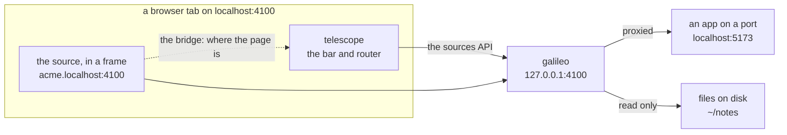

# galileo

**The inspector of a space: the apps and files on this machine, one at a time, under one bar.**

galileo keeps a list of **sources**, the things you want to look at. There are
two kinds:

| Source | Add it as | It shows |
| --- | --- | --- |
| a port | `5173` | the app that answers on that port of this machine |
| files | `~/notes` or `~/out/report.html` | a folder's pages and files, or one file, read only |

Each source gets an address of its own, `<name>.localhost:4100`, and opens
under **telescope**, galileo's bar and router:

```
localhost:4100/sources          the Sources page: add, open and remove sources
localhost:4100/s/acme/pricing   the source acme, at /pricing, under the bar
```



The bar says which source you're on and where in it. Switch source from its
menu, type a path, reload, or open the source in a tab of its own. As you
click around inside a source, the bar and the address follow.

galileo starts nothing: a port source shows whatever already answers there.
It listens on `127.0.0.1` only, and only ever reads files.

## Quick start

Node 20 or later, and nothing to install:

```bash
npm start
```

Open <http://localhost:4100/> and add a source on the Sources page: a name,
and a port such as `5173` or a path such as `~/notes`. Sources can also be
given when galileo starts:

```bash
npm start -- --source web=5173 --source notes=~/notes
```

`npm run demo` starts a sample app and shows it, its folder of files, and this
README as three sources.

## Sources

- **A port** is an app on this machine, such as a dev server. galileo proxies
  it, WebSockets included, so hot reload keeps working. If nothing answers
  yet, the source shows a page that tries again every 2 seconds.
- **Files** are a folder or a single file. A folder shows its `index.html`, or
  else a listing; a single file shows itself alone. Text files open as
  readable pages with a Raw link, images, video, audio and PDFs in their own
  viewers, and HTML as it is. Hidden files (`.env`, `.git`) are never shown,
  nothing outside the source is ever served, and nothing is ever written.
- A source's name becomes its address, so it is lowercase letters, digits and
  dashes. galileo keeps the list in `data/sources.json`, so sources stay
  across restarts.

## telescope

telescope is galileo's whole page: the bar along the top and the view under
it, which is the Sources page or one source in a frame.

- **The bar**: galileo's mark (back to Sources), the source menu (ports and
  files, each with a dot for whether it is there), the path, reload, and open
  on its own.
- **The router**: telescope owns the address. `/sources` is the Sources page;
  `/s/<name>/<path>` is a source at a path. Back and Forward work across
  sources and inside them.
- **The bridge**: each page a source serves gets one small script appended,
  `/__xo/bridge.js`, which tells telescope where the page is whenever that
  changes. That's how the bar follows clicks inside a source.

## How it works

1. **Route by hostname.** `localhost:4100` is galileo's own: telescope and the
   sources API. `acme.localhost:4100` is the source acme. A name nobody added
   gets a page listing the real ones, and never another source.
2. **Proxy or read.** A port source is proxied to its port; a files source is
   read from disk.
3. **Frame.** Every response from a source may be framed only by galileo (and
   by the source itself), so apps that refuse frames still show under the bar,
   and no other site can frame them.
4. **Bridge.** Each HTML page gets the bridge appended as it streams through,
   with its security policy loosened just enough for that one script.

[docs/ARCHITECTURE.md](docs/ARCHITECTURE.md) follows a request through every
part, with diagrams.

## Settings

From the environment, or `.env.local` beside this README (see `.example.env`);
what the shell sets wins.

| Variable | Default | Does |
| --- | --- | --- |
| `PORT` | `4100` | where galileo listens, on `127.0.0.1` only (`--port` wins) |
| `GALILEO_DATA` | `data/` | where galileo keeps its list of sources |

## The demo

```bash
npm run demo
```

| Address | What it is |
| --- | --- |
| <http://localhost:4100/s/acme/> | Acme Notes, a sample app on a port, which normally refuses to be framed |
| <http://localhost:4100/s/site/> | the same site's folder of files, read only |
| <http://localhost:4100/s/readme/> | this README, a single file |
| <http://localhost:4173/> | Acme Notes as its own server sends it |

## Working on galileo

```bash
npm test        # node --test: sources, page rules, files, and galileo end to end
```

No dependencies and no build step: plain ESM JavaScript on Node's own modules,
and plain scripts for telescope. The tests pass a glob to `node --test`, which
needs Node 21 or later. [AGENTS.md](AGENTS.md) has the rules for changing
galileo, and a map of where each part lives.

## Docs

| | |
| --- | --- |
| [docs/ARCHITECTURE.md](docs/ARCHITECTURE.md) | how it works: a request through every part, with diagrams |
| [docs/DECISIONS.md](docs/DECISIONS.md) | why it works that way, and what each choice costs |
| [docs/REFERENCE.md](docs/REFERENCE.md) | commands, addresses, routes, headers, files, data, limits |
| [docs/ROADMAP.md](docs/ROADMAP.md) | what v0 leaves out, and what may come next |
| [telescope/README.md](telescope/README.md) | telescope: the bar, the router and the bridge |
| [AGENTS.md](AGENTS.md) | the contract for agents and people changing galileo |

## Limits

- Safari before macOS 26 can't resolve `*.localhost`.
- A page's bridge is blocked by a security policy set in a `<meta>` tag, since
  only headers are adjusted; the bar then doesn't follow that page.
- A link to another site opens in a tab of its own: the frame shows sources
  only.
- More in [docs/REFERENCE.md](docs/REFERENCE.md#limits).
