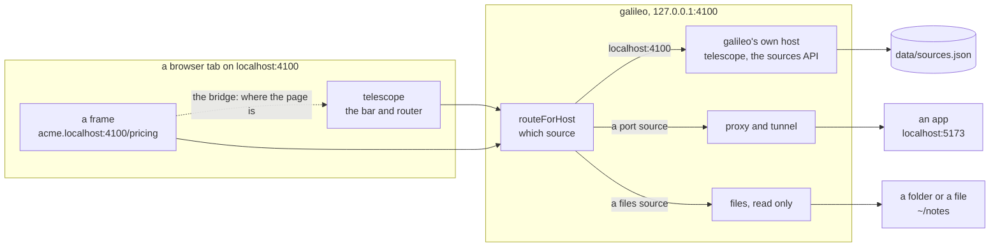
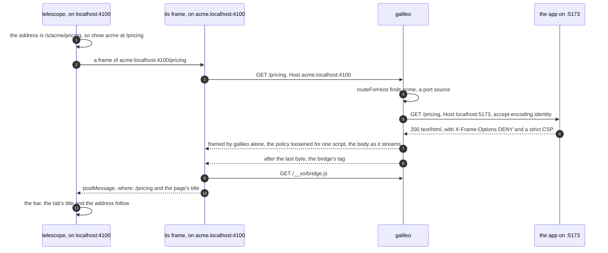
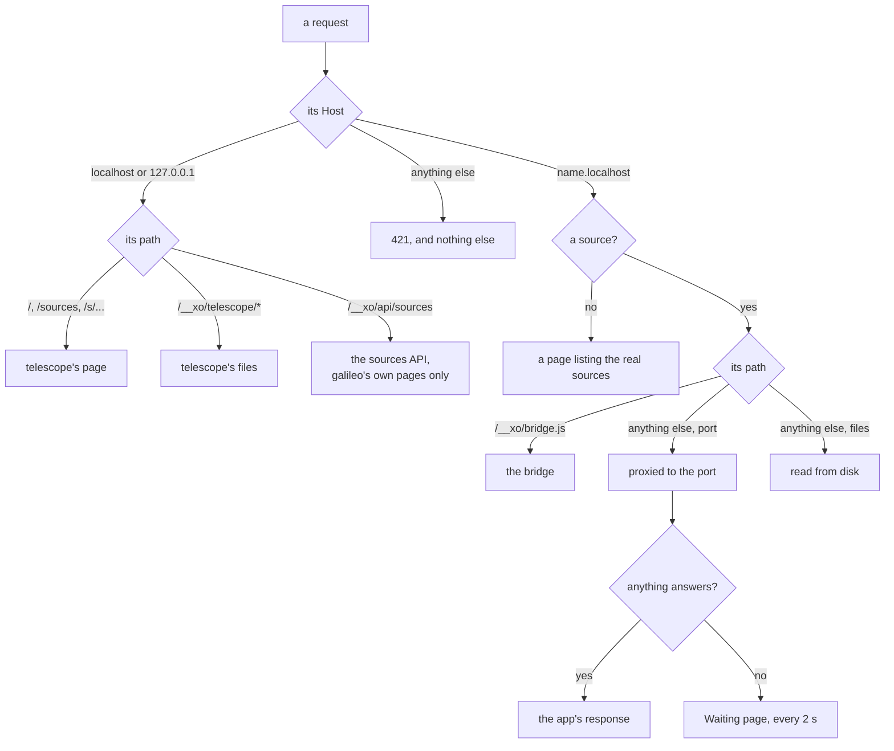
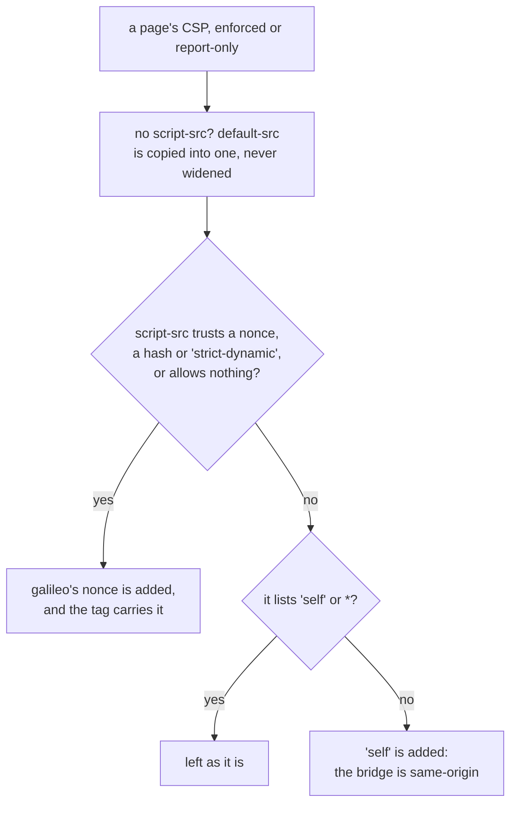
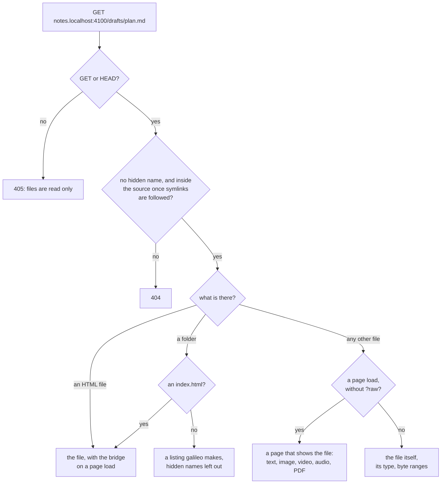
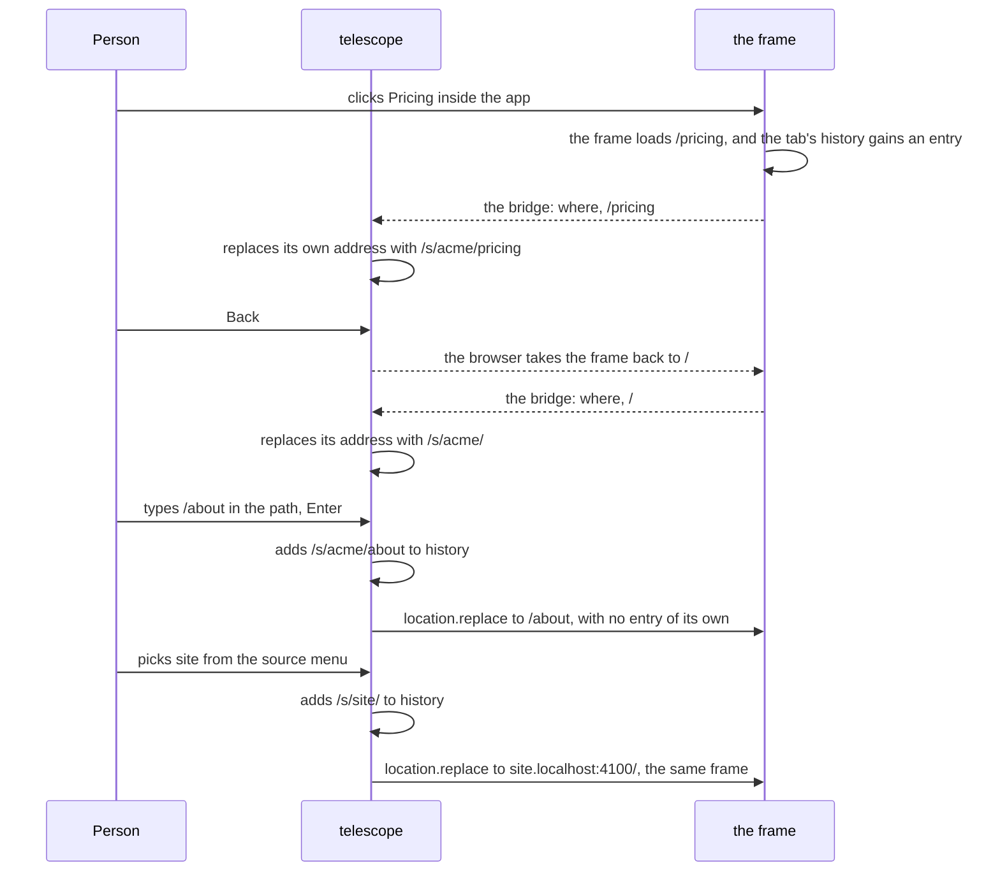
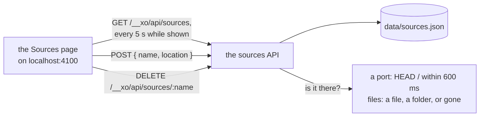
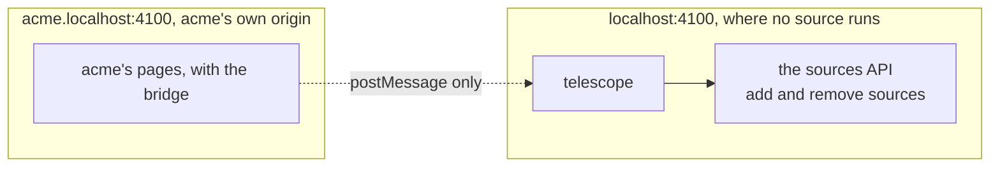

# How galileo works

galileo is one Node.js process on this machine. It keeps a list of sources
(apps on ports, and files or folders), gives each one its own address on one
port, and serves telescope, the bar and router that shows them one at a time.
It starts nothing and writes nothing but its own list.

This page follows a request through galileo, then telescope through a page.
Why each part works the way it does is in [DECISIONS.md](DECISIONS.md), exact
routes, headers and files are in [REFERENCE.md](REFERENCE.md), and what may
come next is in [ROADMAP.md](ROADMAP.md).

- [The picture](#the-picture)
- [Opening a source](#opening-a-source)
- [How a request is sorted](#how-a-request-is-sorted)
- [What changes on the way through](#what-changes-on-the-way-through)
- [A files source](#a-files-source)
- [telescope's router and the bridge](#telescopes-router-and-the-bridge)
- [The Sources page](#the-sources-page)
- [Trust boundaries](#trust-boundaries)
- [What galileo keeps](#what-galileo-keeps)

## The picture



| Part | File | Job |
| --- | --- | --- |
| Sources | `src/sources.mjs` | names, ports and paths, which source a `Host` means, the list and how each source is right now |
| Server | `src/server.mjs` | `createGalileo`: routing by host, telescope and the sources API, the proxy and tunnel, the pages galileo makes on a source's address, the CLI |
| Page rules | `src/inject.mjs` | which responses get the bridge, framing by galileo alone, a page's policy loosened for the bridge |
| Files | `src/files.mjs` | a files source, read only: safe paths, files with their types and ranges, file pages, folder listings |
| telescope | `telescope/` | the page: the bar and router (`telescope.js`), its styles, and the bridge (`bridge.js`) |

## Opening a source



1. **Route.** `routeForHost` reads the `Host` header: `localhost` is galileo's
   own, `acme.localhost` is the source acme, and a name nobody added gets a page
   listing the real ones.
2. **Proxy.** A port source gets the request with its own `Host`, no hop-by-hop
   headers, and `accept-encoding: identity`, so a page comes back uncompressed.
3. **Frame.** `X-Frame-Options` goes, the page's own `frame-ancestors` goes, and
   galileo adds a policy that lets only its own origins (and the source itself)
   frame the response.
4. **Bridge.** A page load answered with HTML gets the bridge's tag appended
   after its last byte, as it streams, and its `script-src` gains a nonce or
   `'self'` for that one script.
5. **Follow.** The bridge posts where the page is; telescope keeps the bar and
   its own address in step.

WebSocket upgrades on a port source's address (hot reload) are tunnelled raw
to the port, with its own `Host`, when they come from the source's own pages,
galileo's, or no page at all; any other upgrade is refused. If nothing
answers on the port, page loads get a "Waiting for acme" page that tries again
every 2 seconds.

## How a request is sorted



## What changes on the way through

Everything here is a pure function in `src/inject.mjs`, tested without a
server.

**To a port:** its own `Host` (`localhost:<port>`), `x-forwarded-host` with
the address the browser used, `accept-encoding: identity`, and no hop-by-hop
headers.

**Back to the browser, every response:** no hop-by-hop headers;
`X-Frame-Options` removed; each policy's `frame-ancestors` removed and
galileo's own added; a `Location` that points at the port rewritten to the
source's address; `Set-Cookie` without `Domain=`.

**Only on a page that gets the bridge:** `Content-Length`, `ETag` and
`Last-Modified` removed, since the body grows by one tag; `x-galileo-bridge:
added`; and each policy's scripts loosened just enough:



A policy that relies on `'unsafe-inline'` takes the "no" branch and never gets
a nonce: browsers ignore `'unsafe-inline'` once a nonce is present, which would
switch the page's own inline scripts off.

## A files source



- A single file is its own source: it answers at `/`, and no other path does.
- The pages galileo makes (listings, file pages, waiting and missing pages)
  carry the bridge too, under a strict policy of their own, so the bar follows
  every step through a folder.
- A file's type comes from its extension; a file without one is shown as text
  when it reads as text.

## telescope's router and the bridge



- telescope adds a history entry only for what it does itself: switching
  source, typing a path, opening the Sources page. Clicks inside a frame add the
  frame's own entries, and telescope only follows them.
- Every source is shown in the same frame, sent from place to place with
  `location.replace`. A frame thrown away would leave its steps in the tab's
  history, each a Back press that does nothing.
- A message counts only from telescope's current frame, and only from a
  source's origin.
- The bridge never wraps the page's functions; it looks at the address a few
  times a second, and when a page restored by Back shows again.

## The Sources page



- `location` is a port (`5173`, `localhost:5173`) or a full path (`~/notes`,
  `/Users/me/notes`); a relative path is refused, since galileo's own folder
  means nothing to the person typing.
- Adding a name that exists points it somewhere else. Removing a source
  removes only galileo's entry: nothing on disk changes.

## Trust boundaries



- galileo listens on `127.0.0.1` only, and a host that is neither galileo's
  nor under `.localhost` gets `421` and nothing else, so a page elsewhere that
  points its own name at this machine (DNS rebinding) learns nothing.
- No source is ever served on galileo's own host, so no source's code runs
  there. The sources API answers galileo's own pages only (`Sec-Fetch-Site`
  `same-origin`, or none as from `curl`), and changes must be JSON, so a form
  on another site can't post one.
- Each source is its own origin, so sources never share cookies or storage
  with each other or with telescope. A source's pages can't reach the API:
  `acme.localhost` and `localhost` are different sites, so their requests are
  `cross-site`, and refused.
- Only galileo's own origins, and the source itself, may frame a source or
  open its WebSockets, so another site can't frame one or reach its hot-reload
  socket, and what the bridge posts reaches telescope only.
- A framed source may go fullscreen and write to the clipboard, nothing more.
  A browser keeps a permission given in a frame for the top page's origin, so
  the camera granted to one source would be granted to all of them.
- A files source serves nothing outside itself and nothing hidden, once
  symlinks are followed: a link with an ordinary name to `.env` is refused
  like `.env`.
- telescope builds everything it shows with text nodes, under a policy that
  allows scripts and styles from galileo's own host only, and frames only
  `*.localhost` on galileo's port.

## What galileo keeps

```
data/sources.json    the sources: { "sources": [{ "name", "type": "port", "port" } or { "name", "type": "files", "path" }] }
```

That is all. It is rewritten whole through a temporary file and a rename, and
one galileo process owns a data folder.
