# How galileo works

galileo is one Node.js process in front of the apps on this machine. It gives
each app, and each version of an app, its own address on one port, routes
every request by its hostname to the app's port or URL, and carries
telescope, XO's in-page bar, into every HTML page it serves. It starts
nothing: apps run however you run them.

This page follows a request through galileo, then telescope through a page,
then each part in turn. Why each part works the way it does is in
[DECISIONS.md](DECISIONS.md), exact routes, headers and files are in
[REFERENCE.md](REFERENCE.md), and what is planned is in
[ROADMAP.md](ROADMAP.md).

- [The picture](#the-picture)
- [A page, from request to telescope](#a-page-from-request-to-telescope)
- [What changes on the way through](#what-changes-on-the-way-through)
- [WebSockets](#websockets)
- [telescope in the page](#telescope-in-the-page)
- [What telescope makes](#what-telescope-makes)
- [Designs](#designs)
- [Where apps come from](#where-apps-come-from)
- [Trust boundaries](#trust-boundaries)
- [What galileo keeps](#what-galileo-keeps)
- [Mounted in another server](#mounted-in-another-server)

## The picture

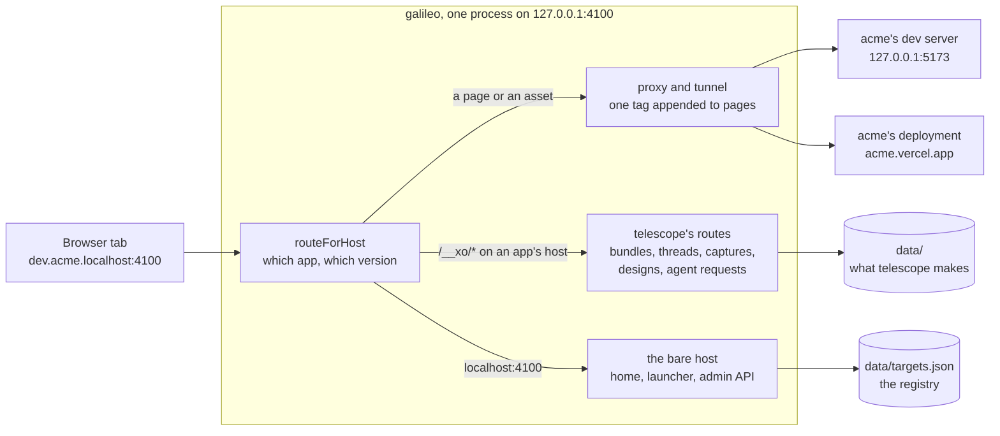

| Part | File | Job |
| --- | --- | --- |
| Routing and registry | `src/targets.mjs` | turns a `Host` header into an app and a version; keeps the apps and saves them to `data/targets.json` |
| Proxy, tunnel and admin API | `src/server.mjs` | forwards requests and WebSocket upgrades to the version's upstream; the waiting and 404 pages; the bare host's pages; galileo's own `/__xo/*` (health, the list of apps, the admin API), handing the rest of `/__xo/*` to telescope; the CLI |
| Page rules | `telescope/server/inject.mjs` | which responses are pages, how their headers change, and the tag |
| telescope's routes | `telescope/server/api.mjs` | `createTelescope`: its bundles, captures, threads, designs and agent requests under `/__xo/`, on app hosts and the bare host |
| telescope's store | `telescope/server/store.mjs`, `uploads.mjs` | threads, designs, agent requests and captures on disk |
| telescope in the page | `telescope/src/`, `layout.mjs`, `index.mjs` | the bar's scripts, the design schema, and the bundles made from them |
| Pages of its own | `home/`, `launcher/` | the home page and the launcher on the bare host |

## A page, from request to telescope

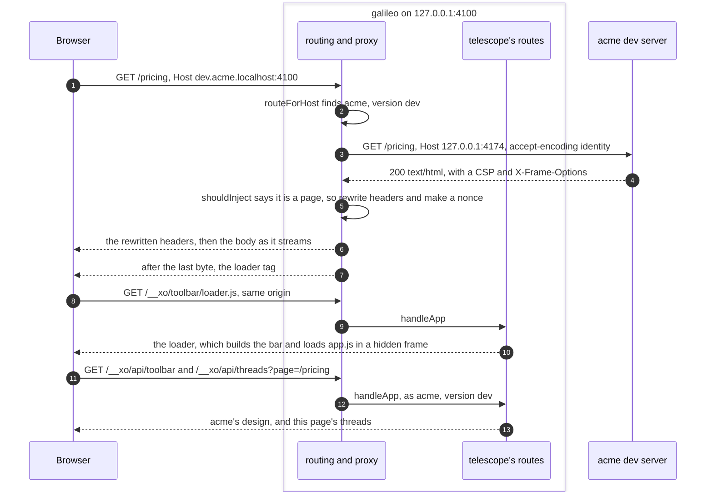

1. **Route.** `routeForHost` reads the `Host` header. `localhost` is galileo's
   own; `acme.localhost` is acme's default version; `dev.acme.localhost` is its
   dev version. A name nobody registered gets a 404 page listing the real ones,
   and never falls through to another app.
2. **Proxy.** The request goes to the version's upstream with the upstream's
   own `Host`, no hop-by-hop headers, and `accept-encoding: identity`, so the
   HTML comes back uncompressed.
3. **Decide.** `shouldInject` says whether the response is a page: a `GET` for
   a document, answered with uncompressed `text/html`, not opted out.
   Anything else (scripts, images, JSON, streams) is piped through untouched.
4. **Rewrite.** A page's headers are adjusted just enough for the tag to run
   and for XO to frame the page: `X-Frame-Options` and `frame-ancestors` go, a
   nonce or `'self'` is added where the policy needs it. Redirects and cookies
   are rewritten to stay on galileo's host.
5. **Append.** The body streams through a transform that adds one
   `<script src="/__xo/toolbar/loader.js">` after the last byte, so the page
   renders as fast as it would without galileo.
6. **Load telescope.** The loader comes from the page's own origin, so the
   page's CSP admits it with `'self'` or the nonce. It builds the bar and runs
   the rest of telescope in a hidden frame (see
   [telescope in the page](#telescope-in-the-page)), which loads the app's
   design and this page's threads. The navbar loads the list of apps when one
   of its menus opens. All of it goes to `/__xo/` on the same origin, which
   galileo scopes to that app.

If the upstream doesn't answer, a "Waiting for acme" page retries every 2
seconds, and still carries telescope. WebSocket upgrades (hot reload) are
tunnelled raw to the same version; any other upgrade is closed.

### How a request is sorted

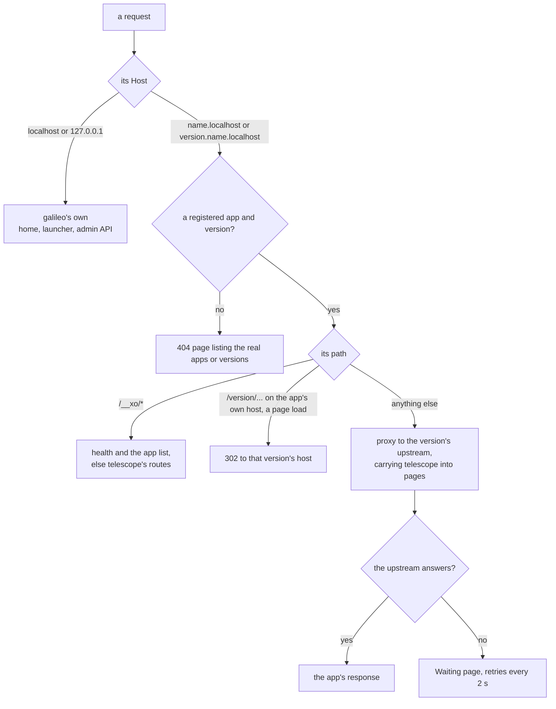

## What changes on the way through

galileo changes as little as it can. Everything here is a pure function in
`telescope/server/inject.mjs`, tested without a server.

**To the upstream:**

- `Host` becomes the upstream's own. `x-forwarded-host` keeps the address the
  browser used, and `x-forwarded-proto` says `http`.
- `accept-encoding: identity`, so a page comes back uncompressed and the tag
  can be appended without decompressing it.
- Hop-by-hop headers and `x-xo-skip-toolbar` are dropped.
- A `*.vercel.app` upstream also gets `x-vercel-skip-toolbar: 1`, so telescope
  stands in for Vercel's toolbar.

**Back to the browser:**

- Hop-by-hop headers are dropped.
- A `Location` that points at the upstream's origin is rewritten to the app's
  host on galileo, and `Set-Cookie` loses its `Domain=`, so redirects and
  cookies stay on galileo's host.
- Only on a page: `X-Frame-Options` goes, each Content Security Policy is
  rewritten (below), `Content-Length`, `ETag` and `Last-Modified` go because
  the body grows by one tag, and `x-xo-toolbar: injected` says telescope was
  added.

**A page's Content Security Policy**, enforced or report-only:

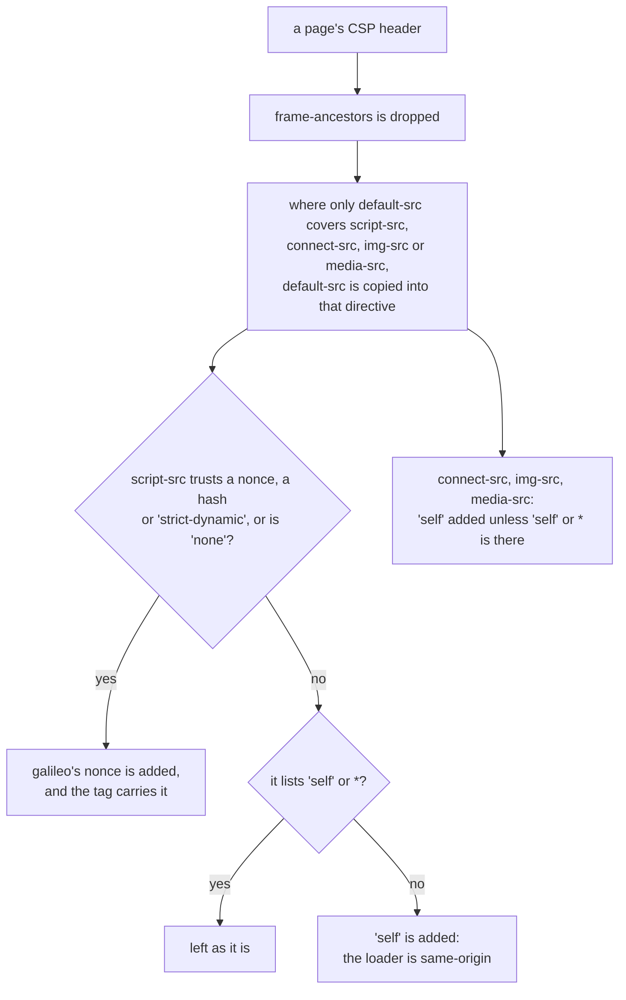

A policy that relies on `'unsafe-inline'` takes the "no" branch and never
gets a nonce: browsers ignore `'unsafe-inline'` once a nonce is present, which
would switch the page's own inline scripts off. `default-src` itself is never
widened, since it also governs styles, fonts and frames.

## WebSockets

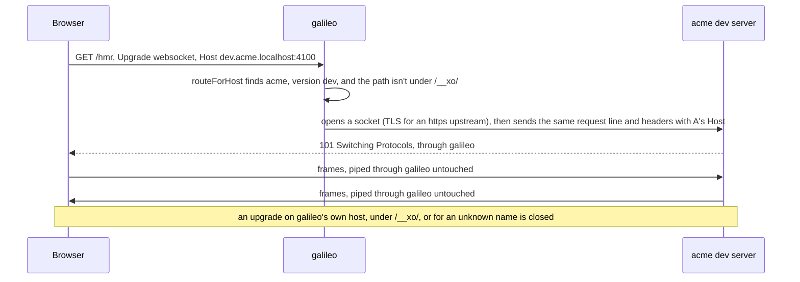

Hot reload keeps working because the socket reaches the same version the page
came from, on that version's own host.

## telescope in the page

telescope has two halves, both in `telescope/`. Its server side
(`telescope/server/`) is made once by galileo with
`createTelescope({ dataDir })`, which then gets every `/__xo/` request that
isn't galileo's own. Its page side is plain scripts in `telescope/src/`,
joined into three bundles (`loader.js`, `app.js`, `designer.js`) by
`telescope/index.mjs` on each request, with no build step. telescope was
called xo-toolbar, and its wire names still are (`/__xo/toolbar/*`,
`data-xo-toolbar`, `window.__xo_toolbar`, `data/toolbars/`), so pages, hosts
and saved designs keep working.

In the page, telescope keeps to itself. Its UI sits in a closed shadow root,
and its code runs in a hidden iframe that shares the page's origin but not its
globals, so the page's styles and scripts don't break it and its own don't
leak out.

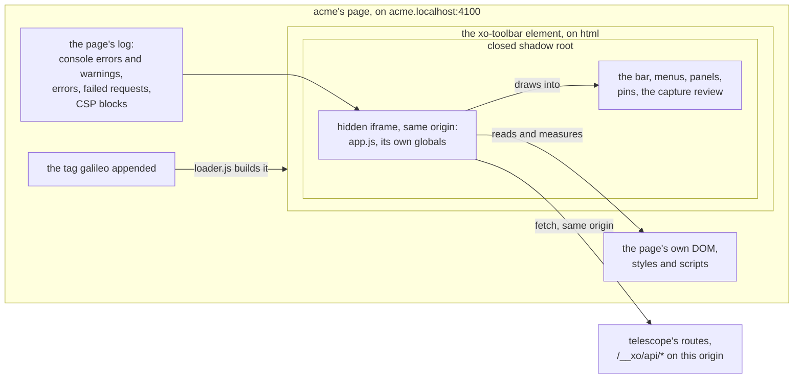

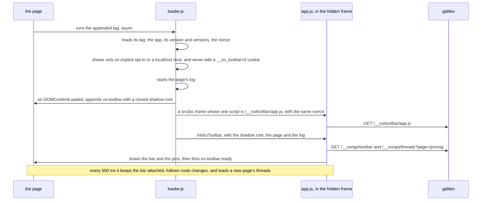

- The log starts when the loader runs, at the end of the page. Failed
  requests come from the page's resource timings, including those made before
  the loader ran, so `fetch` is never wrapped.
- The navbar (`● dev ▾ · acme ▾ · /pricing`) reads the list of apps from
  `/__xo/api/targets` each time one of its menus opens. Every switch of app or
  version is a page load on another origin, since each app and version is
  one.
- A page can add its own tools with `window.__xo_toolbar.addTool`, before or
  after telescope boots; they are never saved into the design.
- [telescope/README.md](../telescope/README.md) has the tools, keys, navbar
  and page API.

## What telescope makes

Everything telescope makes belongs to the app, and is kept by its server side
in `data/`. Each route answers only the app's own origin, and only about that
app.

### Comments

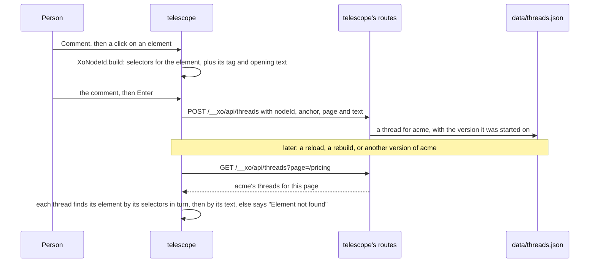

A comment with no element is about the whole page. Replies, resolving and
deleting go to `/__xo/api/threads/:id`, and only from the app that owns the
thread.

### Captures

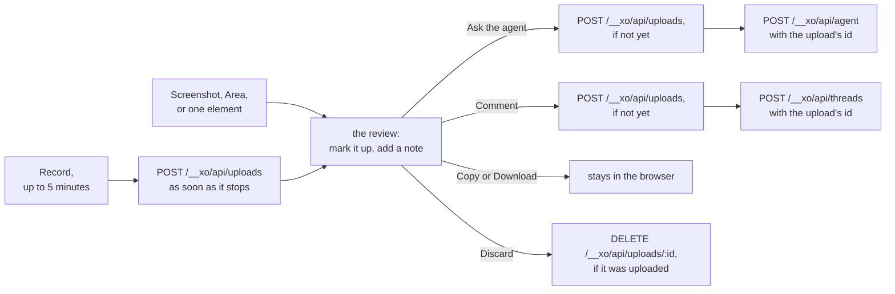

Captures use the Screen Capture API, so they show the tab's real rendering.
An upload is kept in `data/uploads/<app>/` and served back on the app's own
host at `/__xo/uploads/<file>`, with byte ranges so recordings can seek. Pages
get an upload's id and address, never where it sits on disk.

### Requests for the agent

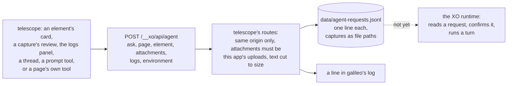

galileo hands requests off and never runs one. The file is the hand-off
point; nothing reads it yet.

## Designs

A design says which tools the bar shows, in what order, where it docks, its
labels and its accent. Which one an app gets:

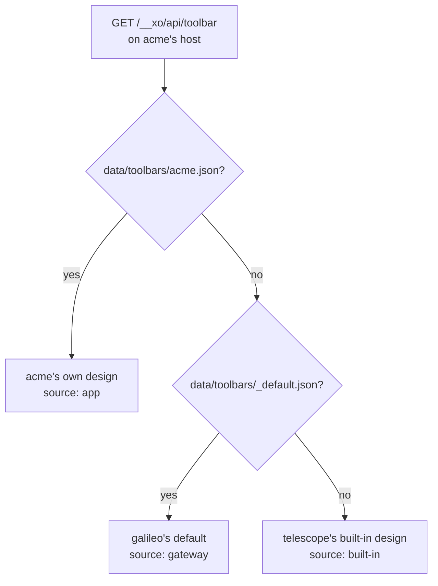

Who can change one:

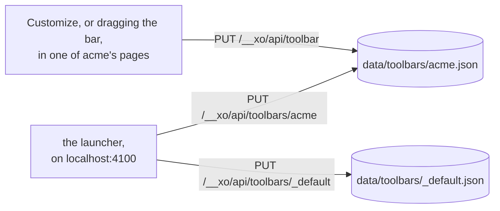

An app's page can change only that app's design; only the launcher can change
another app's, or the default. Every design passes telescope's schema
(`normalizeLayout` in `telescope/layout.mjs`) when it is saved and when it is
read, so a hand-edited file can't break the bar.

## Where apps come from

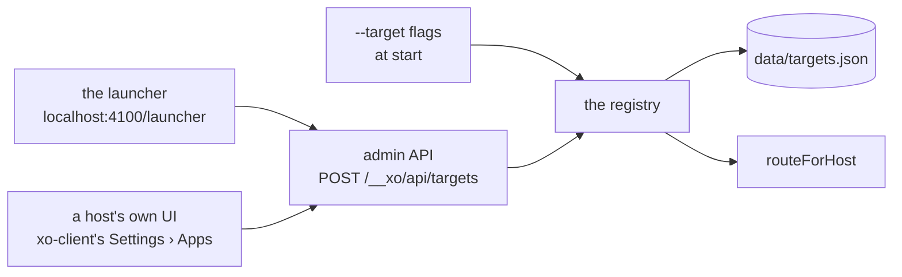

- An app is a name, versions, and an upstream per version: a port, a
  `host:port`, or an `http(s)` URL.
- `--target` flags add apps at start; the admin API adds, changes and removes
  them while galileo runs. The launcher, and hosts such as xo-client, use that
  API.
- The registry saves every change to `data/targets.json` (a temporary file,
  then a rename) and loads it at start. On a clash the flags win, and a default
  version chosen later is kept.
- galileo only routes: whatever serves the port has to be running already.

## Trust boundaries

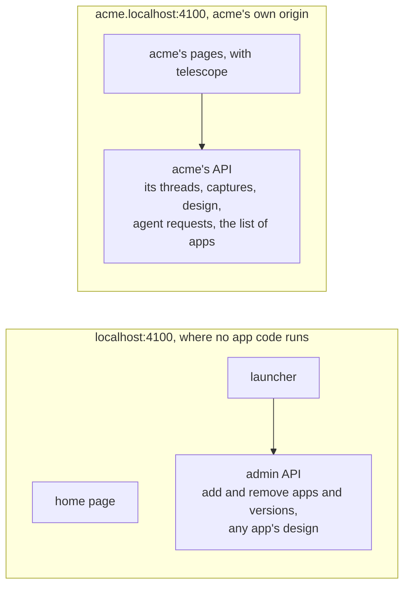

- galileo listens on `127.0.0.1` only.
- The bare host is never proxied, so no app code runs there. It is the only
  origin that can change the set of apps or any app's design. Its API takes
  same-origin requests only, and changes must be JSON, so a form on another
  site can't post one.
- Each app's API answers only that app's own origin, and only about that app.
  telescope runs inside the app's page, so whatever telescope may do, the
  app may do too; nothing there reaches another app or the set of apps.
- Uploads come back to pages without their place on disk; only the agent
  request log records file paths.

## What galileo keeps

```
data/targets.json            the apps and their versions
data/threads.json            comment threads, per app and page
data/agent-requests.jsonl    requests for the agent, one per line, with capture paths
data/toolbars/_default.json  the default telescope design
data/toolbars/<app>.json     an app's own design
data/uploads/<app>/          screenshots and recordings
```

Everything belongs to an app, not a version: threads, captures and designs are
shared by all of an app's versions, and each thread records the version it was
started on. Files are rewritten whole through a temporary file and a rename,
and one galileo process owns a data folder.

## Mounted in another server

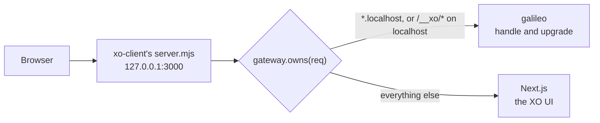

`createGateway()` returns the handlers without listening, so another server can
share its port. xo-client does: `localhost:3000` is XO's UI, which manages apps
in Settings › Apps through the admin API, and every `*.localhost:3000` address
is galileo's. The host keeps the bare host, so galileo's home page and launcher
aren't shown there.
