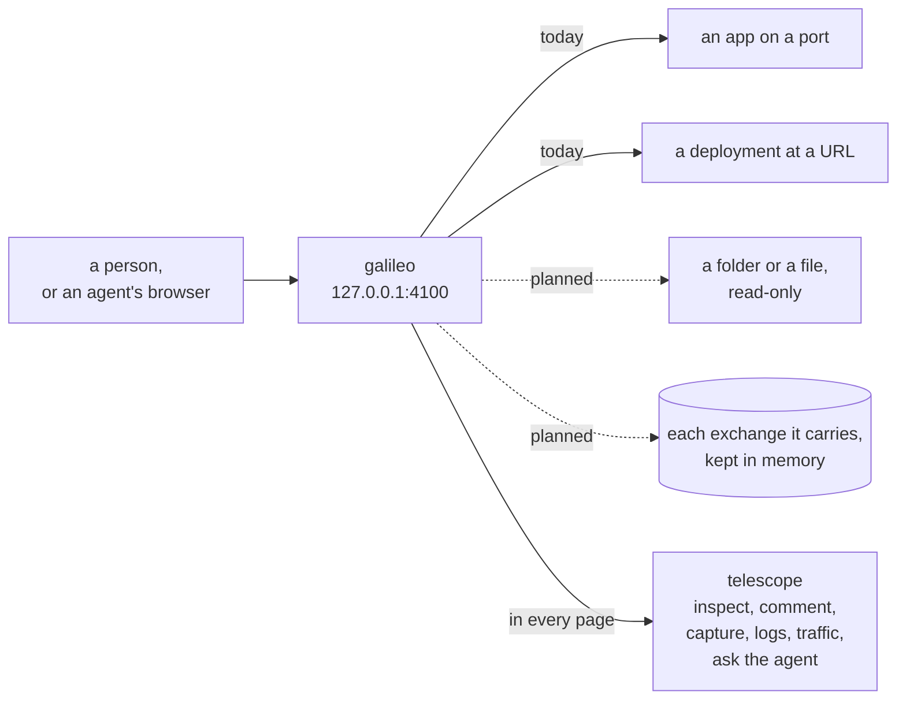
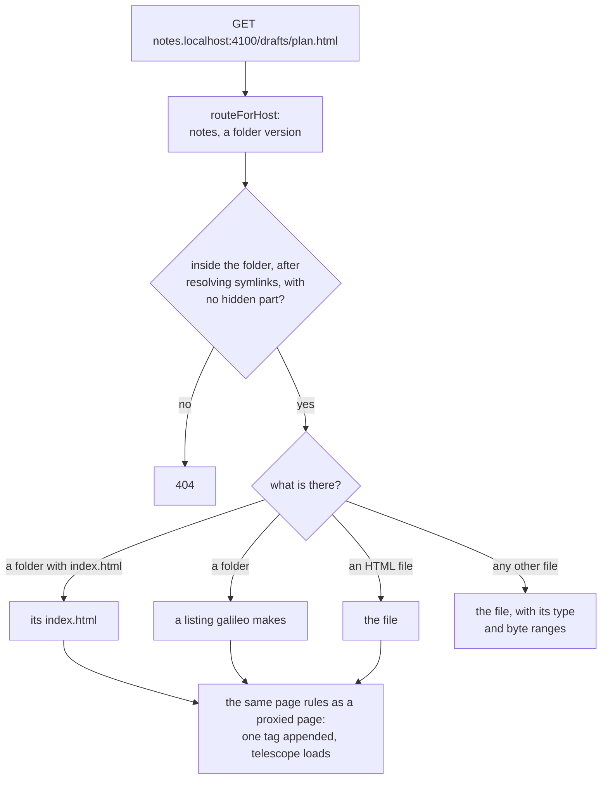
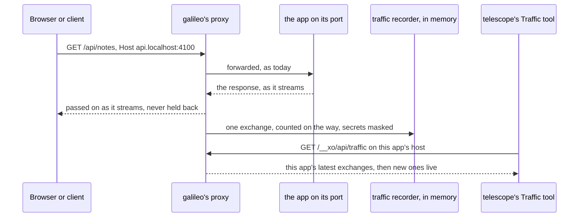

# Where galileo is going: an inspector

galileo today gives apps on local ports, and deployments at URLs, their own
addresses, with telescope in every page. The direction is wider: galileo as
XO's local inspector for anything on this machine, with telescope as the way
to look at it.

This page is a plan. Nothing on it works yet unless the table below says so.
As each part ships, it moves into the [README](../README.md),
[ARCHITECTURE.md](ARCHITECTURE.md) and [REFERENCE.md](REFERENCE.md), and its
rules into [AGENTS.md](../AGENTS.md) and [DECISIONS.md](DECISIONS.md)
(decision 17 is the direction itself).

## What galileo inspects

| What | Its address | What telescope does there | Status |
| --- | --- | --- | --- |
| an app on a local port | `web.localhost:4100` | everything it does today | works today |
| a deployment at a URL | `live.web.localhost:4100` | everything it does today | works today |
| a folder | `notes.localhost:4100` | runs in the folder's HTML files, and in a listing galileo makes | planned |
| a single file | `report.localhost:4100` | the file, opened from its folder | planned |
| the traffic galileo carries | every app's address | a Traffic tool for this app, and a page on galileo's own host for all of them | planned |

## Why

XO's agents make things people need to look at: a running app, a deployment,
an HTML report, a folder of screenshots, an API call that fails. Today only
the first two get an address and telescope. With files, folders and traffic
too, a person can open anything an agent made or touched, point at the exact
part, and hand it back to the agent from the same bar.

## Folders and files

### How it would look

- A folder is added like an app, with a name and a path:
  `npm start -- --target notes=~/notes`, the launcher's "port, URL or folder"
  field, or `POST /__xo/api/targets` with
  `{ "name": "notes", "upstream": "/Users/me/notes" }`.
- A folder can be one version of an app: `--target build.acme=./dist` puts
  the static build at `build.acme.localhost:4100`, beside `dev` and `live`.
- A single file is its folder, opened at that file:
  `--target report=./out/report.html` answers at `report.localhost:4100/`
  with `report.html`, and the assets beside it load as they would from disk.
- `/` serves the folder's `index.html` when it has one, else a listing galileo
  makes. Any other path serves that file with its type, and with byte ranges
  for media.
- HTML files, listings and file views carry telescope like any page, so
  comments, captures and requests for the agent work on them, kept per app as
  they are today.

### A folder request

### Rules it keeps

- **Read, never run.** `GET` and `HEAD` only. galileo executes nothing in the
  folder and writes nothing into it; what telescope makes stays in galileo's
  `data/`. The page's own scripts run in the browser, as they would from disk.
- **Nothing outside the folder.** Encoded `..`, absolute paths and symlinks
  that lead out are refused after the real path is resolved.
- **No hidden files.** `.env`, `.git`, `.ssh` and every other dot name are
  never listed or served. `node_modules` is not listed.
- **No paths on pages.** The navbar and an app's `GET /__xo/api/targets` show
  a folder's name, never where it is on disk, as with uploads today. The bare
  host shows paths.
- **No new process and no new listener.** Files are served from galileo's own
  handler, not by a server per folder.

### What changes in the code

- `src/targets.mjs`: an upstream is a port, a `host:port`, an `http(s)` URL,
  or a path (`/…`, `./…`, `../…`, `~/…`), kept as a `file:` URL in
  `data/targets.json`.
- `src/files.mjs`, new: resolve a path safely, serve a file, make a listing.
  The path rules are pure and tested without a server.
- `src/server.mjs`: a folder version is answered by `files.mjs` instead of the
  proxy, then goes through the same page rules.
- The launcher and the home page: a folder shows as a folder, answering when
  it exists.
- Tests: path safety (encoded `..`, dot names, symlinks out), listings, the tag
  on a folder's HTML, and mounted mode.

## Traffic

### How it would look

- galileo already carries every request to an app's port. It would also
  remember each exchange: method, path, status, type, sizes, timings,
  headers with secrets masked, and which page asked.
- In a page, a **Traffic** tool in telescope lists this app's exchanges as
  they happen, with filters (errors, documents, API calls, sockets), and hands
  one to the agent with the page's logs in a click.
- On galileo's own host, a traffic page lists every app's exchanges, for apps
  without pages (an API on `:5001`) and requests no page made (`curl`).
- A WebSocket tunnel is one entry: when it opened and closed, and the bytes
  each way.

### An exchange, recorded

### Rules it keeps

- **Never slower.** A response is never buffered or held for the record:
  sizes are counted as bytes pass, and a body preview, where there is one, is
  a capped copy taken on the way. Rule 5 in AGENTS.md stays as it is.
- **No secrets in the record.** `Cookie`, `Set-Cookie`, `Authorization`,
  `Proxy-Authorization` and API key headers are masked before anything is
  kept, and so are query values named like a token, key, secret or password.
- **On this machine, in memory.** The last few hundred exchanges per app, gone
  on restart. Keeping some (as a HAR file, or attached to a request for the
  agent) is an explicit step.
- **Scoped like the rest of an app's API.** An app's page sees that app's
  traffic and the requests its own pages made to other apps. Only galileo's
  own host sees everything.

### What changes in the code

- `src/traffic.mjs`, new: the recorder (a ring buffer per app), the masking
  rules (pure, unit-tested), and subscriptions for live views.
- `src/server.mjs`: the proxy and the tunnel record into it as bytes pass.
- `telescope/server/api.mjs`: `GET /__xo/api/traffic` on an app's host,
  scoped to that app, and a live stream for the Traffic tool.
- `telescope/layout.mjs` and `telescope/src/`: a `traffic` built-in tool.
  Saved designs stay valid; one without the tool doesn't show it.
- Tests: masking, the ring buffer, scoping between apps, and a streamed page
  that still streams.

## Order of work

1. Docs and diagrams for what works today, and this plan.
2. Folders and files: read-only, with telescope in their pages.
3. The traffic recorder, its API, and galileo's own traffic page.
4. telescope's Traffic tool, and traffic in requests for the agent.
5. Later, if wanted: rendered Markdown and code views with line anchors for
   comments, HAR export, and a listening port per app for clients that can't
   use `*.localhost`.

Each step lands with its tests, and moves its part of this page into the
other docs.

## Open questions

1. **Folders by name, or by root too?** By name, as apps are added today, or
   also a root whose folders each get an address, as galileo did before it
   dropped folders? This plan assumes by name.
2. **Traffic bodies.** Never kept, or capped text previews that an app turns
   on?
3. **Where traffic lives.** Only in memory, or also saved per app in `data/`?
4. **Clients without `*.localhost`.** Some CLIs and phones can't resolve it. A
   listening port per app would let galileo see their traffic, but breaks
   one port for everything (decision 4).
