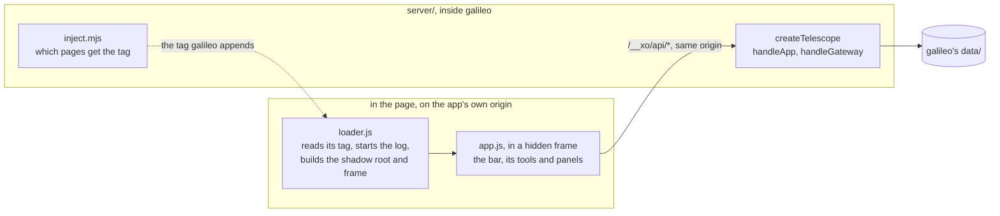

# telescope

telescope is the bar galileo carries into every page it serves, the way Vercel
carries its toolbar into preview deployments. It lives in this folder of
galileo, in two halves: the scripts that run in the page (`src/`), and the
server side galileo hands every telescope request to (`server/`), which
serves the bundles from each app's own origin, answers telescope's API and
keeps what it makes. It was called xo-toolbar; its internal names (the
`/__xo/toolbar/` routes, `data-xo-toolbar`, `window.__xo_toolbar`) keep that
name so pages and saved designs keep working.



galileo's [ARCHITECTURE.md](../docs/ARCHITECTURE.md#telescope-in-the-page)
follows telescope through a page step by step: how it boots, and what happens
to comments, captures and requests for the agent.

What it does in a page:
- **Navbar**: the page's address in parts, `● dev ▾ · acme ▾ · /pricing`:
  version, app and path. The version opens this page on another version, the
  app menu opens another app, and the path goes to another path.
- **Inspect**: hover tooltips (size, type, colors, selector), select an element, ask the agent about it, copy it for an agent.
- **Comment**: pins anchored to elements, or comments on the whole page, with threads that survive reloads and rebuilds.
- **Screenshot, Area and element screenshots**: the real rendering of the tab, cropped to the viewport, a dragged region or one element.
- **Record**: the tab, with the microphone if wanted and clicks shown, paused or discarded from the bar, up to 5 minutes.
- **Markup**: arrows, boxes, freehand and solid "hide" blocks on a screenshot before it leaves the page.
- **Logs**: errors, warnings, failed requests and blocked resources since the page loaded, sent to the agent in one click.
- **Ask the agent**: every capture, comment and log view can go to the agent with a note, the element, the page's logs and its environment.
- **Designs**: which tools, in what order, where the bar docks (six places), labels and accent color, edited live in the Customize panel or in galileo's launcher.

Planned, not built: a **Traffic** tool listing the requests galileo carries for
this app, as galileo grows into an inspector. See
[galileo's roadmap](../docs/ROADMAP.md#traffic).

No dependencies and no build step: plain classic scripts in the page, plain ESM
on the server. galileo's `npm test` runs telescope's tests with its own.

## Keys

| Keys | Does |
| --- | --- |
| Alt+Shift+I | inspect |
| Alt+Shift+C | comment |
| Alt+Shift+S | screenshot |
| Alt+Shift+A | capture an area, or click one element |
| Alt+Shift+R | start or stop recording |
| Alt+Shift+L | logs |
| Alt+Shift+X | open or close the bar |
| Esc | close the innermost thing that is open |

In a screenshot: A arrow, B box, D draw, H hide, ⌘/Ctrl+Z undo, ⌘/Ctrl+Enter ask the agent.
Drag the XO handle anywhere; the bar docks where you drop it and the design keeps it.

## Files

```
src/loader.js     the script a page references: reads its tag, builds the shadow root and frame, starts the log
src/ui.js         XoUi: icons, tool names, base styles, the element helper, the accent theme
src/node-id.js    XoNodeId: element anchors (build and resolve)
src/capture.js    XoCapture: screen capture, frames, cropping and recording
src/annotate.js   XoAnnotate: markup on a screenshot
src/designer.js   XoDesigner: the design editor and a still preview of a design
src/app.js        telescope itself
layout.mjs        the design schema and normalizeLayout
index.mjs         the bundles and the schema
server/index.mjs  what galileo imports: createTelescope and the page rules
server/api.mjs    createTelescope: telescope's routes under /__xo/, on app hosts and the gateway's host
server/inject.mjs the page rules: which responses carry the tag, header rewrites, the tag itself
server/store.mjs  threads, agent requests and designs on disk
server/uploads.mjs captures on disk, served with byte ranges
server/http.mjs   JSON in and out, and the same-origin and JSON-only rules
test/             node --test suites: the page rules, the bundles and the schema
```

## How galileo serves it

galileo makes one telescope and hands it every request under `/__xo/` that
isn't galileo's own (an app's health, the list of apps, the admin API):

```js
import { createTelescope, loaderTag, shouldInject } from "../telescope/server/index.mjs"; // from galileo's src/

const telescope = createTelescope({ dataDir, log });
// On an app's host; app = { name, version, upstream, label }. Resolves false for routes that aren't telescope's.
if (await telescope.handleApp(req, res, app)) return;
// On the gateway's own host: the design editor and every app's design.
if (await telescope.handleGateway(req, res, { apps: [{ name, url }] })) return;
```

Errors are thrown as `Object.assign(new Error(message), { status })`, for the
host to answer as `{ error }` JSON. `server/inject.mjs` holds the page rules
galileo's proxy uses: `shouldInject`, `loaderTag`, and the request and response
header rewrites.

telescope serves three bundles, all built by `index.mjs` from `src/` on each
call (so an edit shows on the next page load):

| Bundle | Made of | Used by |
| --- | --- | --- |
| `loader.js` | `src/loader.js` | every page, through the tag below |
| `app.js` | schema, ui, node-id, capture, annotate, designer, app | the loader's hidden frame |
| `designer.js` | schema, ui, designer | a host's own settings page: galileo's launcher, xo-client's Settings › Apps |

```js
import { normalizeLayout, readBundle } from "../index.mjs"; // as telescope's server/ uses it

const code = await readBundle("app.js"); // undefined for anything that isn't a bundle
const layout = normalizeLayout(input);   // always a valid design
```

Each bundle that needs it starts with `var XoToolbarSchema = {…}`, generated from
`layout.mjs`, so the browser and galileo always agree on tools, docks and the
default design.

### The contract

What galileo does for telescope, and what any other host would have to do:

1. **Carry one tag** at the end of each HTML page, from the page's own origin:

   ```html
   <script async data-xo-toolbar data-explicit-opt-in="true" data-preview-id="…"
           data-project="acme" data-app-version="dev" data-app-versions="dev,live"
           nonce="…" src="/__xo/toolbar/loader.js"></script>
   ```

   `data-app-version` and `data-app-versions` are optional: with more than one
   version, the bar shows which one the page came from.

2. **Serve** `/__xo/toolbar/loader.js` and `/__xo/toolbar/app.js` on that origin.
3. **Answer telescope's API** under `/__xo/api/` on that origin:

   | Route | Does |
   | --- | --- |
   | `GET /threads?page=…`, `POST /threads`, `POST /threads/:id/comments`, `PATCH /threads/:id`, `DELETE /threads/:id` | comments; a thread with an empty `nodeId` is about the whole page |
   | `POST /uploads`, `DELETE /uploads/:id` | a screenshot (`image/png`) or recording (`video/webm`, `video/mp4`) as the raw body |
   | `GET /__xo/uploads/<file>` | an upload, with byte ranges so recordings can seek |
   | `POST /agent` | `{ ask, page, element?, attachments?, logs?, environment }` |
   | `GET /toolbar`, `PUT /toolbar`, `DELETE /toolbar` | this app's design: `{ layout, source, isDefault, options }` |
   | `GET /targets` | `{ current, currentVersion, manageIn?, manageAt?, targets: [{ name, url, defaultVersion, upstream, up, versions: [{ name, url, default, upstream, up }] }] }` for the navbar |

4. **Let it run under the page's policy**: a nonce the page's CSP trusts (or
   `'self'` in `script-src`), and `'self'` in `connect-src`, `img-src` and
   `media-src`. galileo rewrites policies to do this.
5. **In a frame**, give the frame `allow="display-capture"` so captures work
   there. Chrome then crops the tab's capture to the frame (Region Capture); a
   browser without it captures the whole tab and says so.

### Designs

```json
{
  "version": 1,
  "dock":  { "position": "bottom-center", "labels": true, "startOpen": true },
  "theme": { "accent": "#83d63a" },
  "items": [
    { "type": "apps" }, { "type": "separator" }, { "type": "inspect" }, { "type": "comment" },
    { "type": "link", "id": "storybook", "label": "Storybook", "icon": "book", "href": "http://localhost:6006/" },
    { "type": "prompt", "id": "polish", "label": "Polish", "icon": "sparkles",
      "prompt": "Tighten the spacing and type of this element", "scope": "element" }
  ]
}
```

- Tools: `apps` (the navbar), `inspect`, `comment`, `threads`, `screenshot`, `area`, `record`, `logs`, plus `separator`.
- `link` opens a page in a new tab. `prompt` sends its text to the agent about the element you pick next (`scope: "element"`) or the whole page (`scope: "page"`).
- Docks: `top-left`, `top-center`, `top-right`, `bottom-left`, `bottom-center`, `bottom-right`.
- `normalizeLayout(anything)` always returns a valid design: unknown tools are dropped, built-in tools appear once, text is trimmed, links must be http(s), and there are at most 24 items.
- galileo says where a design came from with `source`: `app` (the app's own), `gateway` (galileo's default) or `built-in`. The Customize panel explains it, and "Use the default design" drops the app's own.

## The navbar

The bar opens with the page's address, in the order it is built from:

```
● dev ▾ · acme ▾ · /pricing  ⧉
│         │        │          └ copies the whole address
│         │        └ the path: type one, Enter goes there, on this version
│         └ the app: another one, opened at its root on its default version
└ the version: this same page on another version

= http://dev.acme.localhost:4100/pricing
```

- **Version** comes from the tag's `data-app-version` (`main` without one). Its
  menu lists the app's versions, each with where it is served from and
  whether it answers; picking one keeps the path, query and fragment.
- **App** comes from `data-project`. Its menu lists every app on galileo with
  the address it is served from. Type to find one, Enter opens the first
  match, and ↑ ↓ move through the list. An app opens at its root, on its
  default version, since paths don't carry between apps.
- **Path** is the page's path, query and fragment, kept in step as a
  single-page app changes route. Enter goes to what you typed on this version;
  anything that would leave the page's origin is refused, since the switchers
  do that.
- Both menus load `/targets` each time they open. Their last line says where
  apps are managed (`manageIn`): a link to that page (`manageAt`, a path on
  the host's own origin) in a tab of its own, and a note when the page is
  framed, as in XO's Browser, which already shows that place.

## For a page

```js
function addTools() {
  window.__xo_toolbar.addTool({
    id: "flags", label: "Flags", icon: "flag",
    onClick(context) {
      // context: { app, page, element, toast(text), ask(text), screenshot() → Promise<Blob> }
      context.toast(`Flags for ${context.app}`);
    },
  });
}
if (window.__xo_toolbar) addTools();
else addEventListener("xo-toolbar:ready", addTools, { once: true });
```

`window.__xo_toolbar` also has `removeTool(id)`, `logs()` (a copy of the log),
`debug()` (a snapshot of telescope's state, with every visible control) and
`unmount()`. Tools added this way show after the design's own and are not saved
with it.

## Limits

- Captures use the Screen Capture API. Chrome and Edge offer the current tab in
  one click; other browsers show their picker, and only Chromium crops inside a frame.
- The log starts when the loader runs, at the end of the page. Requests are read
  from the page's resource timings (status codes of same-origin and CORS-enabled
  responses), and only `console.error` and `console.warn` are noted.
- A page can call its own telescope's API. Nothing there is privileged; an
  agent request should still be confirmed on the agent's side before it runs.
